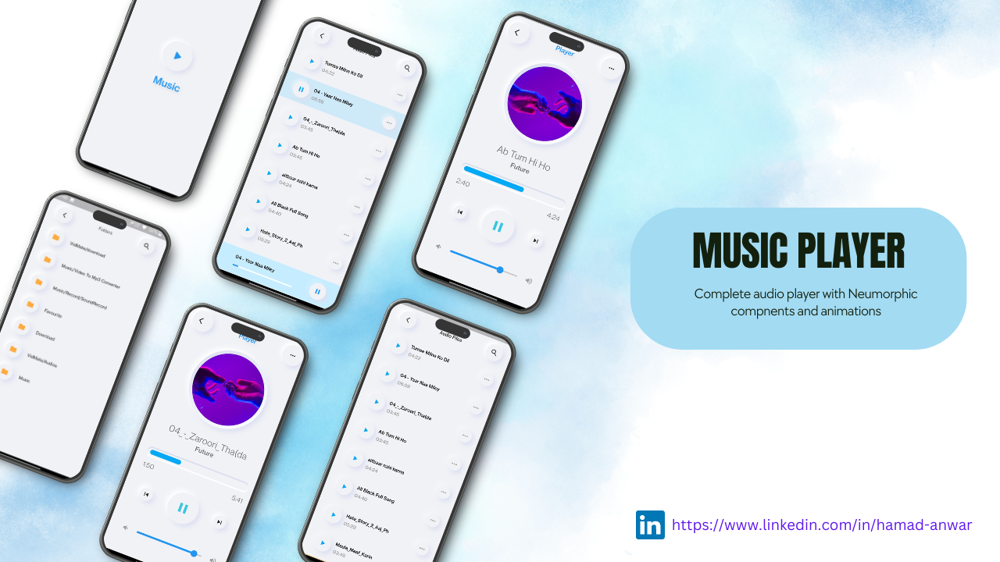

<div align="center">



# 🎵 Flutter Music Player

### Aplicación de streaming musical desarrollada con Flutter 🚀

<p align="center">
  <b>Flutter Music Player</b> es una aplicación moderna de reproducción musical que permite explorar y reproducir archivos de audio almacenados localmente en el dispositivo, utilizando una elegante interfaz neumórfica y animaciones fluidas.
</p>

<p align="center">
  
  
  
  
</p>

<p align="center">
  <a href="#-preview">Preview</a> •
  <a href="#-características">Características</a> •
  <a href="#-tecnologías-utilizadas">Tecnologías</a> •
  <a href="#-instalación">Instalación</a> •
  <a href="#-roadmap">Roadmap</a>
</p>

</div>

---

# 🌊 Acerca del Proyecto

**Flutter Music Player** es una aplicación desarrollada en Flutter enfocada en ofrecer una experiencia moderna y minimalista para reproducir música desde el almacenamiento local del dispositivo.

La aplicación incluye:

- 🎵 Reproducción de música local
- 🎧 Controles multimedia completos
- 💿 Gestión automática de archivos de audio
- ✨ Diseño neumórfico elegante
- ⚡ Animaciones suaves
- 📱 Experiencia optimizada para dispositivos móviles

El proyecto está orientado al aprendizaje y práctica de:

- Flutter
- Dart
- UI/UX móvil
- Gestión de estados
- Reproducción multimedia
- Diseño neumórfico

---

# 📸 Preview

<div align="center">


</div>

---

# ✨ Características

## 🎵 Reproductor Musical

- ▶️ Reproducción de audio local
- ⏸️ Pausar y reanudar canciones
- ⏭️ Cambiar entre pistas
- 🔊 Control de volumen
- 🎧 Reproductor dedicado

---

## 🎨 Interfaz Moderna

- ✨ Diseño neumórfico elegante
- ⚡ Animaciones fluidas
- 📱 UI minimalista
- 🌙 Experiencia visual moderna
- 🚀 Navegación intuitiva

---

## 📂 Gestión Multimedia

- 📁 Escaneo de archivos de audio
- 🎵 Organización automática de canciones
- 📲 Acceso al almacenamiento del dispositivo
- ⚡ Carga rápida de contenido multimedia

---

# 🛠️ Tecnologías Utilizadas

## 📱 Desarrollo Mobile

<p>
  
</p>

- Flutter
- Dart

---

## ⚙️ Librerías y Dependencias

<p>
  
</p>

### Dependencias principales

- `get`
- `just_audio`
- `percent_indicator`
- `path_provider`
- `on_audio_query`
- `permission_handler`
- `flutter_neumorphic`
- `flutter_storage_path`

---

# 📂 Estructura del Proyecto

```bash
Flutter-Music-Player/
│
├── lib/                  # Código fuente principal
├── assets/               # Recursos multimedia
├── android/              # Configuración Android
├── ios/                  # Configuración iOS
├── demo.png              # Captura de pantalla
├── pubspec.yaml          # Dependencias
└── README.md
```

---

# ⚡ Instalación

## 1️⃣ Clonar el repositorio

```bash
git clone <repository-url>
```

---

## 2️⃣ Entrar al proyecto

```bash
cd Flutter-Music-Player
```

---

## 3️⃣ Instalar dependencias

```bash
flutter pub get
```

---

## 4️⃣ Ejecutar la aplicación

```bash
flutter run
```

---

# 🔥 Requisitos

## 🛠️ Software necesario

- Flutter SDK
- Dart SDK
- Android Studio o VS Code
- Emulador Android/iOS o dispositivo físico

---

# ▶️ Configurar Flutter

## Verificar instalación

```bash
flutter doctor
```

---

## Ejecutar en modo debug

```bash
flutter run
```

---

# 📦 Dependencias Utilizadas

## 🎵 Audio y Multimedia

- `just_audio`
- `on_audio_query`
- `flutter_storage_path`

---

## 🎨 UI y Diseño

- `flutter_neumorphic`
- `percent_indicator`

---

## ⚙️ Utilidades

- `get`
- `path_provider`
- `permission_handler`
- `path`

---

# 🧠 Objetivos del Proyecto

## 🎯 Aprender y practicar

- Desarrollo móvil con Flutter
- Gestión multimedia
- Reproducción de audio
- Diseño neumórfico
- Manejo de permisos
- Interfaces modernas
- Navegación y estados

---

# 📊 Roadmap

## 🚧 Próximamente

- 🎶 Playlists personalizadas
- ❤️ Sistema de favoritos
- 🌙 Dark Mode
- ☁️ Streaming online
- 🔍 Buscador de canciones
- 🎧 Ecualizador de audio
- 📀 Soporte para álbumes
- 🔥 Animaciones avanzadas

---

# 🤝 Contribuciones

Las contribuciones son bienvenidas ❤️

## Pasos para contribuir

1. Haz Fork del proyecto
2. Crea una rama

```bash
git checkout -b feature/nueva-funcion
```

3. Realiza tus cambios
4. Haz commit

```bash
git commit -m "✨ Nueva funcionalidad"
```

5. Haz push

```bash
git push origin feature/nueva-funcion
```

6. Abre un Pull Request 🚀

---

# 🙌 Agradecimientos

- 🎨 Inspirado en diseños de Neumorphism UI
- 🚀 Gracias a la comunidad Flutter
- 💙 Recursos y librerías Open Source

---

# 👨‍💻 Autor

<div align="center">


## Flutter Developer

Apasionado por el desarrollo móvil, interfaces modernas y aplicaciones multimedia.

</div>

---

# 📬 Contacto

📧 Email: rh676838@gmail.com

Si tienes preguntas, sugerencias o mejoras para el proyecto, no dudes en contactar.

---

# 🌟 Apoya el Proyecto

Si te gusta Flutter Music Player:

⭐ Dale una estrella al repositorio  
🍴 Haz Fork del proyecto  
📢 Compártelo con otros desarrolladores

---

# 📜 Licencia

Este proyecto está destinado al aprendizaje y desarrollo educativo con Flutter.

---

<div align="center">

### 🎵 Flutter Music Player — Música, diseño y experiencia moderna en una sola app.

</div>

